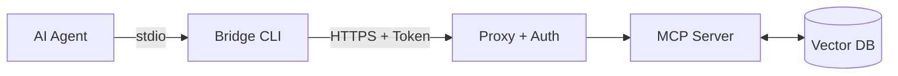

<div align="center">
  <h1>🚀 Remote RAG MCP Server & Auth Proxy</h1>
  <p><strong>エンタープライズの社内ナレッジを、AIエージェントに安全に接続する架け橋</strong></p>

  <p>
    <b>🛡️ 堅牢なセキュリティ (OAuth 2.0)</b> &nbsp;•&nbsp; 
    <b>🎯 圧倒的な検索精度 (Hybrid RAG)</b> &nbsp;•&nbsp; 
    <b>🔌 シームレスなAI連携 (MCP)</b>
  </p>

  [](#)
  [](#)
  [](#)
  [](https://modelcontextprotocol.io/)
  [](#)
</div>

<br />

社内ナレッジベース（社内Wikiや機密文書等）を検索するための高精度な**RAG（検索拡張生成）エンジン**を、[Model Context Protocol (MCP)](https://modelcontextprotocol.io/) を通じてAIエージェント（Cursor, Claude Desktop等）に提供するエンタープライズ向け基盤です。

単なる検索サーバーにとどまらず、**汎用的な OAuth 2.0 / OIDC 認証**とプロキシ機構を統合し、セキュアなネットワーク越しのアクセスを標準でサポートしています。

### 🌟 本プロジェクトがもたらす3つの価値
1. **脱・固定クレデンシャル**: 漏洩リスクの高いAPIキー管理から解放され、全社標準のIdP（Okta等）を用いた安全なアクセス管理を実現します。
2. **AIの文脈理解を底上げする精度**: ベクトル×FTSのハイブリッド検索とRerankerの再評価により、「AIが的外れな社内情報を参照する」課題を解決します。
3. **インフラを問わない接続性**: クライアントPCとリモートサーバー間を意識させない透過的なブリッジにより、場所を問わず安全なAI活用環境を提供します。

---

## 📖 目次

- [なぜこのプロジェクトが必要か？ (Why?)](#-なぜこのプロジェクトが必要か-why)
- [主な機能 (Features)](#-主な機能-features)
- [ユースケース・対話デモ](#-ユースケース対話デモ)
- [アーキテクチャ構成図](#-アーキテクチャ構成図-簡易版)
- [クイックスタート](#-クイックスタート-デプロイから連携まで)
- [ディレクトリ構造](#-ディレクトリ構造)
- [ドキュメント一覧](#-ドキュメント一覧)
- [よくある質問 (FAQ)](#-よくある質問-faq)

---

## 🤔 なぜこのプロジェクトが必要か？ (Why?)

AIエージェントの業務活用が進む中、「社内の機密データ（Wiki、仕様書、議事録）をAIに読み込ませたい」というニーズが急増しています。これに対する最適解の一つが **Model Context Protocol (MCP)** ですが、これを企業環境へ導入するにあたり **2つの大きな壁** が存在しました。

1. **認証・認可の壁**: リモートにある社内のMCPサーバーへアクセスするには、APIキーなどの固定クレデンシャルを各PCに配布するしかなく、漏洩リスクや管理コスト（ローテーションの手間）が課題でした。
2. **検索精度の壁**: AIエージェントが複雑な日本語の文脈を理解し、社内の膨大なドキュメントの中から「本当に必要な数行」を見つけ出すには、高度なRAGアーキテクチャが必要でした。

**Remote RAG MCP Server & Auth Proxy** は、これらの課題を同時に解決します。
AIエージェントに複雑な認証ロジックを持たせることなく、企業で標準的に用いられる **OAuth 2.0 / OIDC**（OktaやAuth0等）を利用した安全なアクセスを実現し、最高峰のハイブリッド検索バックエンドを提供します。

---

## ✨ 主な機能 (Features)

*   **🛡️ セキュアな認証プロキシ (Zero Trust Ready)**
    Caddy + 独自実装の Auth Helper により、MCP通信の直前で OAuth 2.0 のトークン検証（RFC 7662: Token Introspection）を実行。特定のベンダーに依存しない多層防御を実現します。
*   **💻 透過的なクライアント Bridge**
    macOS KeychainやWindows Credential Managerと自動連携。ブラウザを通じたログイン（PKCEフロー）でトークンを安全に取得・更新し、AIエージェントの標準入出力（`stdio`）をサーバーの `SSE` にシームレスにブリッジします。
*   **🔍 高度なハイブリッド検索 (Vector + FTS)**
    [LanceDB](https://lancedb.github.io/lancedb/)を採用し、ベクトル検索とキーワード検索を融合。さらにCrossEncoder（Reranker）による再評価を行い、最も関連性の高いチャンクだけを正確に抽出します。
*   **🧠 プラガブルなAIモデル設定**
    用途に合わせてEmbeddingモデルとRerankerモデルを環境変数から自由に差し替え可能。デフォルトで軽量かつ高精度な `intfloat/multilingual-e5-base` を採用し、完全ローカルでデータ外部送信ゼロを実現。

---

## 💡 ユースケース・対話デモ

設定完了後、Claude Desktop等からシームレスに社内データを参照できます。

> **👤 ユーザー:**  
> 「社内の人工知能プロジェクトの歴史と、現在のステータスについて検索して教えて。」
> 
> **🤖 AIエージェント (Claude):**  
> *(自動的に `remote-rag` のMCPツール `hybrid_search` を呼び出し)*  
> 「検索結果によると、社内の人工知能プロジェクトは2000年代以降のディープラーニングの登場を機に第三次ブームとして始まりました。直近の議事録（プロジェクトX）によれば、現在のステータスは...」

---

## 🧩 アーキテクチャ構成図 (簡易版)

ローカル側のBridge CLIがトークン管理と通信の中継を行い、サーバー側のCaddy+Auth Helperが認証の関所として機能します。
（より詳細な連携フローやシーケンス図は、**[アーキテクチャ設計書](docs/ARCHITECTURE.md)** をご覧ください）



---

## 🚀 クイックスタート: デプロイから連携まで

DockerとDocker Compose（サーバー側）、およびGo（クライアントビルド用）がインストールされている環境での手順です。

### 1. サーバー環境の設定と起動
まずはサーバー（RAGエンジンとプロキシ）を立ち上げます。

```bash
cd deploy

# 1. 認証情報の環境変数を設定（認可サーバーの情報を記載）
# ※ OAuthを使用しないテスト環境の場合は、空の.envを作成してください。
touch .env

# 2. サーバー群のビルドと起動
docker compose up -d
```

### 2. サンプルデータの取り込み（Ingestion）
RAGエンジン用のデータベースにサンプルデータ（Wikipedia等）を取り込むため、`mcp-server` コンテナ内でスクリプトを実行します。

```bash
# コンテナ内でWikipediaから20記事を取得してDBに保存
docker exec -it mcp-server python scripts/ingest_cli.py wiki --count 20
```
*(※初回実行時は、各種AIモデルが自動でダウンロードされ、Dockerボリュームにキャッシュされます)*

### 3. クライアント(Bridge)のビルド
次に、AIエージェント（手元のPC）で動作するブリッジCLIをビルドします。

```bash
cd ../client/bridge
go build -o remote-rag-bridge .
```

### 4. Claude Desktop / Cursor との連携
最後に、AIエージェントのMCP設定ファイル（Claude Desktopの場合は `claude_desktop_config.json`）にサーバーを登録します。

```json
{
  "mcpServers": {
    "remote-rag": {
      "command": "/絶対パス/remote-rag-bridge",
      "args": ["--url", "https://<デプロイ先のドメイン>/sse"]
    }
  }
}
```

これで設定は完了です！

---

## 📁 ディレクトリ構造

本リポジトリは役割ごとに明確にコンポーネントが分割されています。

```text
.
├── client/          # エージェントから呼び出されるGo言語製のブリッジCLI
├── server/          # サーバーサイドのメインロジック群
│   ├── core/        # Python製のRAGエンジンおよびMCPサーバー (FastMCP)
│   └── auth-helper/ # Go言語製の認証補助サーバー (Token検証 / Redisキャッシュ)
├── deploy/          # Docker ComposeやCaddyfile等のデプロイ設定
└── docs/            # 各種ドキュメント群
```

---

## 📚 ドキュメント一覧

より高度な運用やカスタマイズについては、以下のドキュメントを参照してください。

| ドキュメント | 内容 |
| :--- | :--- |
| **[アーキテクチャ設計書](docs/ARCHITECTURE.md)** | システム全体の構成図、各コンポーネントの役割と認証連携（PKCE）のシーケンス図。 |
| **[運用手順書](docs/OPERATIONS.md)** | サーバー環境変数の設定、デプロイ手順、認証エラー等のトラブルシューティング。 |
| **[AIモデル設定ガイド](docs/MODELS.md)** | 環境変数を用いたAIモデル（Embedding/Reranker）の柔軟な差し替え方法と、品質・処理速度・メモリ消費の比較表。 |
| **[開発者ガイド](docs/DEVELOPMENT.md)** | 各コンポーネントのビルド手法、ローカル仮想環境の構築、AIモデル変更時の動作テスト方法。 |

---

## ❓ よくある質問 (FAQ)

**Q. 特定のIdP（Okta, Auth0, Entra IDなど）に依存していますか？**  
A. いいえ。RFC 7662 (Token Introspection) をサポートする標準的なOAuth 2.0 / OIDC互換の認可サーバーであれば、ベンダーを問わず利用可能です。

**Q. AIモデルを変更することは可能ですか？**  
A. はい。用途に応じて、超軽量モデルから「BGE-M3」のような最高峰モデル、あるいは日本語特化モデルまで環境変数で容易に差し替え可能です。詳細は [MODELS.md](docs/MODELS.md) をご覧ください。

**Q. クライアント側のBridge CLIはWindowsに対応していますか？**  
A. はい。Go言語で書かれているため、macOS、Linux、Windowsのいずれでもクロスコンパイルして利用可能です。認証情報は各OS標準のシークレットマネージャに安全に保管されます。

---

## 📄 コントリビューション

*   **IssueやPull Requestは大歓迎です！**
*   新たなAIモデルの検証結果や、クライアント機能の拡充など、皆様からのコントリビューションをお待ちしております。
