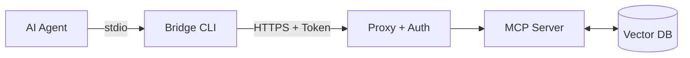

# Remote RAG MCP Server & Auth Proxy

[](#)
[](#)
[](#)
[](https://modelcontextprotocol.io/)

社内ナレッジベース（社内Wikiや社内文書等）を検索するための高精度な**RAG（検索拡張生成）エンジン**を、[Model Context Protocol (MCP)](https://modelcontextprotocol.io/) を通じてAIエージェント（Cursor, Claude Desktop等）に提供するエンタープライズ向け基盤です。

単純な検索サーバーにとどまらず、**汎用的な OAuth 2.0 / OIDC 認証**とプロキシ機構を統合し、セキュアなネットワーク越しのアクセスを標準でサポートしています。

---

## ✨ 主な機能 (Features)

*   **🔍 高度なハイブリッド検索**: [LanceDB](https://lancedb.github.io/lancedb/)を採用し、ベクトル検索とフルテキスト検索(FTS)を組み合わせたハイブリッド検索を提供。さらにCrossEncoder（Reranker）による再評価を行い、社内文書の中から最も関連性の高いチャンクを正確に抽出します。
*   **🧠 柔軟なAIモデル設定**: EmbeddingモデルとRerankerモデルは環境変数から自由に差し替え可能（デフォルトで高精度な `intfloat/multilingual-e5-base` を採用）。ローカル完結型でデータを外部APIに送信しません。
*   **🔒 セキュアな認証プロキシ**: Caddy + 独自実装の Auth Helper により、MCP通信の直前で OAuth 2.0 のトークン検証（RFC 7662: Token Introspection）を実行。AIクライアント側に複雑な認証ロジックを持たせずに多層防御を実現します。
*   **💻 透過的なクライアントBridge**: macOS KeychainやWindows Credential Managerと自動連携し、認証情報（トークン）を安全に保持・更新しつつ、AIエージェントの `stdio` をサーバーの `SSE` (Server-Sent Events) にシームレスにブリッジします。

---

## 📁 ディレクトリ構造

本リポジトリは役割ごとに明確にコンポーネントが分割されています。

- `client/` : エージェント（Claude Desktop等）から呼び出されるGo言語製のブリッジCLI（認証連携＆SSE接続）。
- `server/` : サーバーサイドのメインロジック群。
  - `core/` : Python製のRAGエンジンおよびMCPサーバー（FastMCP）実装。
  - `auth-helper/` : Go言語製の認証補助サーバー。Caddyからのリクエストを受け、トークンの検証とキャッシュ(Redis)を行います。
- `deploy/` : サーバー群を一括起動するための設定ファイル（Docker ComposeやCaddyfile）。
- `docs/` : アーキテクチャ図や運用手順などの各種ドキュメント。

---

## 🧩 アーキテクチャ構成図 (簡易版)

より詳細なコンポーネント連携やシーケンス図については、**[アーキテクチャ設計書](docs/ARCHITECTURE.md)** をご覧ください。



---

## 🚀 クイックスタート: デプロイから連携まで

DockerとDocker Compose（サーバー側）、およびGo（クライアントビルド用）がインストールされている環境での手順です。

### 1. サーバー環境の設定と起動
まずはサーバー（RAGエンジンとプロキシ）を立ち上げます。

```bash
cd deploy

# 1. 認証情報の環境変数を設定（認可サーバーの情報を記載）
# ※ OAuthを使用しないテスト環境の場合は、空の.envを作成してください。
touch .env

# 2. サーバー群のビルドと起動
docker compose up -d
```

### 2. サンプルデータの取り込み（Ingestion）
RAGエンジン用のデータベースにサンプルデータ（Wikipedia等）を取り込むため、`mcp-server` コンテナ内でスクリプトを実行します。

```bash
# コンテナ内でWikipediaから20記事を取得してDBに保存
docker exec -it mcp-server python scripts/ingest_cli.py wiki --count 20
```
*(※初回実行時は、HuggingFaceから各種AIモデルが自動でダウンロードされます。これらはDockerボリュームにキャッシュされます。)*

### 3. クライアント(Bridge)のビルド
次に、AIエージェント（手元のPC）で動作するブリッジCLIをビルドします。

```bash
cd ../client/bridge
go build -o remote-rag-bridge .
```

### 4. Claude Desktop / Cursor との連携
最後に、AIエージェントのMCP設定ファイル（Claude Desktopの場合は `claude_desktop_config.json`）にサーバーを登録します。

```json
{
  "mcpServers": {
    "remote-rag": {
      "command": "/絶対パス/remote-rag-bridge",
      "args": ["--url", "https://<デプロイ先のドメイン>/sse"]
    }
  }
}
```

これで設定は完了です！Claudeに「Wikipediaから人工知能の歴史について検索して」と指示すると、ブリッジCLIが自動的にブラウザを開いて認証を行い、セキュアに検索を実行して回答します。

---

## 📚 ドキュメント (Documentation)

より高度な運用やカスタマイズについては、以下のドキュメントを参照してください。

- **[アーキテクチャ設計書 (ARCHITECTURE.md)](docs/ARCHITECTURE.md)**: システム全体の構成図、各コンポーネントの役割と連携フロー。
- **[運用手順書 (OPERATIONS.md)](docs/OPERATIONS.md)**: 環境変数の設定、デプロイ手順、トラブルシューティング。
- **[開発者ガイド (DEVELOPMENT.md)](docs/DEVELOPMENT.md)**: クロスコンパイル手法やローカル開発環境の構築方法。
- **[AIモデル設定ガイド (MODELS.md)](docs/MODELS.md)**: 環境変数によるAIモデル（Embedding/Reranker）の柔軟な差し替え方法やメモリ消費の見積もり。
