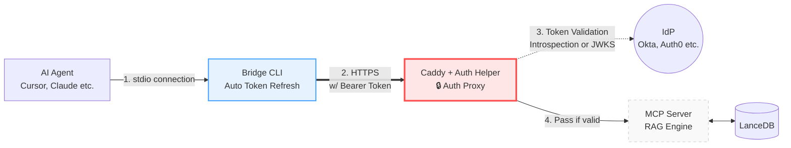

<div align="center">
  <h1>🚀 RRAG (Remote RAG) MCP Server & Auth Proxy</h1>
  <p><strong>A secure bridge connecting enterprise internal knowledge to AI agents</strong></p>

  <p>
    <b>🛡️ Robust Security (OAuth 2.0 & JWKS)</b> &nbsp;•&nbsp; 
    <b>🎯 Incredible Search Accuracy (Hybrid RAG)</b> &nbsp;•&nbsp; 
    <b>🔌 Seamless AI Integration (MCP)</b>
  </p>

  [](#)
  [](#)
  [](#)
  [](https://modelcontextprotocol.io/)
  [](#)
</div>

<p align="center">
  <em><a href="README_ja.md">日本語の README はこちら (Japanese README)</a></em>
</p>

<br />

An enterprise-ready platform providing a highly accurate **RAG (Retrieval-Augmented Generation) engine** to search internal knowledge bases (e.g., wikis, confidential documents), delivered to AI agents like Cursor or Claude Desktop via the [Model Context Protocol (MCP)](https://modelcontextprotocol.io/).

More than just a search server, RRAG natively integrates a **generic OAuth 2.0 / OIDC authentication and proxy mechanism**, enabling secure remote access over the network.

### 🌟 Three Key Values of this Project
1. **Goodbye Static Credentials**: Escape the high-risk management of API keys. RRAG relies on company-standard IdPs (e.g., Okta, Auth0, GitLab) for secure access management.
2. **Elevating AI Context Understanding**: Combining Vector and Full-Text Search (FTS) with Cross-Encoder (Reranker) re-evaluation completely resolves the problem of AI referencing irrelevant internal info.
3. **Infrastructure-agnostic Connectivity**: A transparent bridge client that hides the boundaries between the local PC and the remote server, providing a secure AI environment anywhere.

---

## 📖 Table of Contents

- [Why is this project needed? (Why?)](#-why-is-this-project-needed-why)
- [Features](#-features)
- [Use Case & Demo](#-use-case--demo)
- [Architecture Overview](#-architecture-overview)
- [Quick Start](#-quick-start-deployment-to-integration)
- [Directory Structure](#-directory-structure)
- [Documentation](#-documentation)
- [FAQ](#-faq)

---

## 🤔 Why is this project needed? (Why?)

As the utilization of AI agents in business accelerates, the demand to "feed internal confidential data (wikis, specs, meeting notes) to AI" is surging. The **Model Context Protocol (MCP)** is one of the best answers for this, but introducing it to enterprise environments poses **two major hurdles**:

1. **The Wall of Authentication & Authorization**: To access an internal MCP server remotely, companies had to distribute fixed credentials like API keys to each PC. This created massive security risks (leaks) and high management costs (rotation).
2. **The Wall of Search Accuracy**: To understand complex business context and pinpoint the "exact few lines needed" out of massive document stores, a highly sophisticated RAG architecture is required.

**RRAG MCP Server & Auth Proxy** solves both challenges simultaneously.
Without embedding complex authentication logic into the AI agent, it achieves secure access using standard **OAuth 2.0 / OIDC** while providing a top-tier hybrid search backend.

---

## ✨ Features

*   **🛡️ Secure Auth Proxy (Zero Trust Ready)**
    Caddy + a custom Auth Helper validate OAuth 2.0 tokens right before MCP communication. It supports both **Token Introspection (RFC 7662)** and **Local JWT Validation via JWKS** for lightning-fast verification without relying on specific vendors.
*   **👤 Attribute-based Access Control (ABAC)**
    Configure fine-grained filtering based on IdP claims. Validate `iss`, `aud`, `client_id`, and `scopes` (strict AND conditions), along with user attributes like `email` domains, exact emails, or `groups` (AND conditions).
*   **💻 Transparent Client Bridge**
    Automatically integrates with macOS Keychain or Windows Credential Manager. By acquiring/refreshing tokens via browser (PKCE flow), it seamlessly bridges the AI agent's standard I/O (`stdio`) to the server's `SSE`.
*   **🔍 Advanced Hybrid Search (Vector + FTS)**
    Leveraging [LanceDB](https://lancedb.github.io/lancedb/), it fuses vector search and keyword search. It then applies a CrossEncoder (Reranker) to extract only the most relevant chunks.
*   **🧠 Pluggable AI Models**
    Freely swap Embedding and Reranker models via environment variables. Defaults to the lightweight and highly accurate `intfloat/multilingual-e5-base`, running entirely locally with zero external data transmission.

---

## 💡 Use Case & Demo

Once configured, you can seamlessly reference internal data from Claude Desktop or Cursor.

> **👤 User:**  
> "Search and tell me about the history and current status of our internal AI project."
> 
> **🤖 AI Agent (Claude):**  
> *(Automatically calls RRAG's MCP tool `hybrid_search`)*  
> "According to the search results, the internal AI project started as the third AI boom with the emergence of deep learning in the 2000s. The latest meeting notes (Project X) indicate the current status is..."

---

## 🧩 Architecture Overview

The local Bridge CLI automates token acquisition, while the Caddy + Auth Helper on the server acts as the **"Authentication Gatekeeper"**. This allows the MCP server itself to remain completely free of authentication logic, focusing entirely on secure RAG searches.

(For detailed sequence diagrams, see the **[Architecture Document](docs/ARCHITECTURE.md)**)



---

## 🚀 Quick Start: Deployment to Integration

Prerequisites: Docker, Docker Compose (Server side), and Go (for Client build).

### 1. Server Environment Setup & Startup
First, launch the server (RAG engine and proxy).

```bash
cd deploy

# 1. Set Auth environment variables (IdP info, JWKS URL, etc.)
# * For a no-auth testing environment, create an empty .env file.
touch .env

# 2. Build and start servers
docker compose up -d
```

### 2. Ingest Sample Data
Run a script inside the `mcp-server` container to import sample data into the RAG database.

```bash
# Fetch 20 Wikipedia articles and save to DB
docker exec -it mcp-server python scripts/ingest_cli.py wiki --count 20
```
*(On first run, AI models are automatically downloaded and cached in a Docker volume)*

### 3. Client (Bridge) Installation
Prepare the Bridge CLI on the local PC running the AI agent.

**macOS / Linux (Homebrew):**
```bash
brew tap ryodocx/remote-rag
brew install rrag-bridge
```

**Windows (Scoop):**
```powershell
scoop bucket add rrag https://github.com/ryodocx/remote-rag.git
scoop install rrag-bridge
```

**Manual Download (Windows, etc.):**
1. Download the archive for your environment (e.g., `rrag-bridge-windows-amd64.zip`) from the [GitHub Releases](https://github.com/ryodocx/remote-rag/releases) page.
2. Extract the ZIP file to any folder (e.g., `C:\tools\rrag-bridge`).
3. Add the extracted folder to your system's `PATH` environment variable.
4. Restart your terminal and verify the `rrag-bridge` command works.

**Install via `go install` (All OS):**
```bash
go install github.com/ryodocx/remote-rag/client/bridge@latest
```

### 4. Integration with Claude Desktop / Cursor
Register the server in your AI agent's MCP configuration file (e.g., `claude_desktop_config.json` for Claude Desktop).

```json
{
  "mcpServers": {
    "rrag": {
      "command": "/absolute/path/to/rrag-bridge",
      "args": ["--url", "https://<your-deployed-domain>"]
    }
  }
}
```

Setup complete!

---

## 🔓 No-Auth Mode (Local Testing)

If you want to easily test in a secure internal network without OAuth, you can bypass authentication.

### Pattern 1: Mock Authentication at the Proxy
Leave the auth variables in `deploy/.env` **empty**. The `auth-helper` will consider any Bearer token valid.

```env
OAUTH_INTROSPECT_URL=
OAUTH_CLIENT_ID=
OAUTH_CLIENT_SECRET=
OAUTH_JWKS_URL=
```
*(The Bridge CLI client requests will pass through even with a dummy token)*

### Pattern 2: Call the RAG Engine Directly (Easiest)
If you don't need network access and just want to search local data, run the Python RAG engine directly via `stdio`.

**Claude Desktop / Cursor Config:**
```json
{
  "mcpServers": {
    "rrag-local": {
      "command": "python",
      "args": [
        "/absolute/path/to/server/core/src/mcp_server/server.py",
        "--transport",
        "stdio"
      ]
    }
  }
}
```
*(Requires Python 3.14+ and packages from `server/core/requirements.txt`)*

---

## 📁 Directory Structure

```text
.
├── client/          # Go-based Bridge CLI called by agents
├── server/          # Server-side logic
│   ├── core/        # Python RAG engine & MCP Server (FastMCP)
│   └── auth-helper/ # Go Auth proxy (Token validation / JWKS / Caching)
├── deploy/          # Deployment configs (Docker Compose, Caddyfile)
└── docs/            # Documentation
```

---

## 📚 Documentation

| Document | Content |
| :--- | :--- |
| **[Architecture](docs/ARCHITECTURE.md)** | System components, proxy architecture, and PKCE auth sequence diagrams. |
| **[Operations Manual](docs/OPERATIONS.md)** | Server environment variables, deployment steps, and troubleshooting. |
| **[Okta Setup Guide](docs/OKTA_SETUP.md)** | App registration and custom claims config for Okta (OAuth 2.0 / OIDC). |
| **[GitLab Setup Guide](docs/GITLAB_SETUP.md)** | App registration and claim details for GitLab (gitlab.com / Self-hosted). |
| **[AI Models Guide](docs/MODELS.md)** | How to swap Embedding/Reranker models, with comparisons for quality, speed, and memory usage. |
| **[Development Guide](docs/DEVELOPMENT.md)** | Build instructions, local environments, and testing AI models. |

---

## ❓ FAQ

**Q. Is this tied to a specific IdP (Okta, Auth0, Entra ID)?**  
A. No. It supports any standard OAuth 2.0 / OIDC compliant authorization server via Token Introspection (RFC 7662) or JWKS local validation.

**Q. Can I change the AI models?**  
A. Yes. You can easily switch out models via environment variables—from ultra-lightweight to high-end models like "BGE-M3". See [MODELS.md](docs/MODELS.md).

**Q. Does the Bridge CLI support Windows?**  
A. Yes. Since it's written in Go, it's cross-compiled for macOS, Linux, and Windows. Credentials are safely stored in each OS's native secret manager.

---

## 📄 Contributing

*   **Issues and Pull Requests are highly welcomed!**
*   We welcome contributions such as new AI model benchmarks, client enhancements, and bug fixes.
