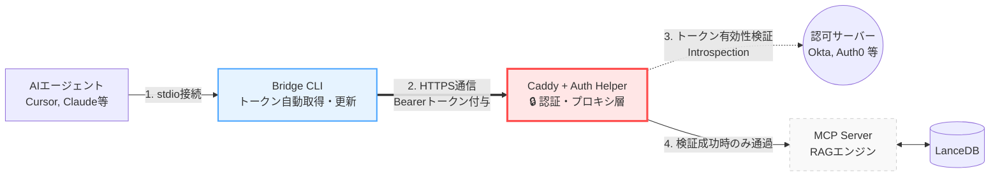

<div align="center">
  <h1>🚀 RRAG (Remote RAG) MCP Server & Auth Proxy</h1>
  <p><strong>OAuth 2.0 認証プロキシとハイブリッド検索を統合したリモート MCP サーバー</strong></p>

  <p>
    <b>🛡️ OAuth 2.0 & JWKS 認証</b> &nbsp;•&nbsp; 
    <b>🎯 ハイブリッド RAG 検索</b> &nbsp;•&nbsp; 
    <b>🔌 MCP プロトコル対応</b>
  </p>

  [](#)
  [](#)
  [](#)
  [](https://modelcontextprotocol.io/)
  [](#)
</div>

<p align="center">
  <em><a href="README.md">English README is here</a></em>
</p>

<br />

社内ナレッジベース（社内Wikiや機密文書等）を検索するための高精度な**RAG（検索拡張生成）エンジン**を、AIエージェント（Cursor, Claude Desktop等）, ChatGPT, Copilot Chat等のチャットUIに提供するエンタープライズ向け基盤です。

単なる検索サーバーにとどまらず、**汎用的な OAuth 2.0 / OIDC 認証**とプロキシ機構を統合し、セキュアなネットワーク越しのアクセスを標準でサポートしています。

### 🌟 主なアーキテクチャの特徴
1. **標準化された認証管理**: APIキーの代わりに標準のOAuth 2.0 / OIDC (Okta, Auth0 等) を用いて動的かつ安全なアクセス制御を行います。
2. **ハイブリッド検索パイプライン**: ベクトル検索、Full-Text Search (FTS)、Cross-Encoder (Reranker) を組み合わせ、検索精度を向上させます。
3. **透過的なクライアントブリッジ**: トークン管理を自動化し、標準入出力 (stdio) を Server-Sent Events (SSE) へプロキシするローカルデーモンを提供します。

---

## 📖 目次

- [背景と課題](#背景と課題)
- [主な機能 (Features)](#主な機能-features)
- [ユースケース・対話デモ](#ユースケース対話デモ)
- [アーキテクチャ構成図 (簡易版)](#アーキテクチャ構成図-簡易版)
- [クイックスタート: デプロイから連携まで](#クイックスタート-デプロイから連携まで)
- [ローカルでの認証なし利用 (No-Auth Mode)](#ローカルでの認証なし利用-no-auth-mode)
- [ディレクトリ構造](#ディレクトリ構造)
- [ドキュメント一覧](#ドキュメント一覧)
- [よくある質問 (FAQ)](#よくある質問-faq)
- [コントリビューション](#コントリビューション)

---

## 🤔 背景と課題

AIエージェントの業務活用が進む中、「社内データ（Wiki、仕様書、議事録など）をAIのコンテキストとして利用したい」というニーズが高まっています。これに対する有力な手段の一つが **Model Context Protocol (MCP)** ですが、これを企業環境へ導入するにあたり、主に**2つの技術的課題**が存在します。

1. **リモートアクセスのセキュリティ**: リモートにあるMCPサーバーへアクセスするためには、APIキーなどの固定クレデンシャルを各クライアントに配布するケースが多く、漏洩リスクや管理コスト（ローテーションの手間）が課題となります。
2. **検索精度の確保**: 企業内の膨大なドキュメントから必要な情報を正確に抽出するには、単純なベクトル検索だけでは精度が不足しがちであり、高度なRAGパイプラインが求められます。

**RRAG MCP Server & Auth Proxy** は、これらの課題に対応するための基盤です。
AIエージェント側に複雑な認証ロジックを組み込むことなく、標準的な **OAuth 2.0 / OIDC** を利用したアクセス制御を実現し、あらかじめ最適化されたハイブリッド検索バックエンドを提供します。

---

## ✨ 主な機能 (Features)

*   **🛡️ OAuth 2.0 認証プロキシ**
    Caddy + 独自実装の Auth Helper により、MCP通信の直前で OAuth 2.0 のトークン検証を実行。**Token Introspection (RFC 7662)** に加え、**JWKSによるローカル検証**にも対応しています。
*   **👤 属性ベースのアクセス制御 (ABAC)**
    IdPからのクレームに基づくきめ細やかなフィルタリングをサポート。`iss`, `aud`, `client_id`, `scopes` といった厳格な環境変数チェックに加え、`email` ドメインや特定の `groups` に基づく柔軟な検証（AND条件）が可能です。
*   **💻 透過的なクライアント Bridge**
    macOS KeychainやWindows Credential Managerと自動連携。ブラウザを通じたログイン（PKCEフロー）でトークンを取得・更新し、AIエージェントの標準入出力（`stdio`）をサーバーの `SSE` にシームレスにブリッジします。
*   **🔍 ハイブリッド検索 (Vector + FTS)**
    [LanceDB](https://lancedb.github.io/lancedb/)を採用し、ベクトル検索とキーワード検索を融合。さらにCrossEncoder（Reranker）による再評価を行い、関連性の高いチャンクを抽出します。
*   **🧩 柔軟なモデル設定**
    用途に合わせてEmbeddingモデルとRerankerモデルを環境変数から差し替え可能。デフォルトで `intfloat/multilingual-e5-base` を採用しています。

---

## 💡 ユースケース・対話デモ

設定完了後、Claude Desktop等からシームレスに社内データを参照できます。

> **👤 ユーザー:**  
> 「社内の人工知能プロジェクトの歴史と、現在のステータスについて検索して教えて。」
> 
> **🤖 AIエージェント (Claude):**  
> *(自動的に `rrag` のMCPツール `search_wiki` を呼び出し)*  
> 「検索結果によると、社内の人工知能プロジェクトは2000年代以降のディープラーニングの登場を機に第三次ブームとして始まりました。直近の議事録（プロジェクトX）によれば、現在のステータスは...」

---

## 🧩 アーキテクチャ構成図 (簡易版)

ローカル側のBridge CLIがトークン取得を自動化し、サーバー側のCaddy+Auth Helperが**認証プロキシ**として機能します。これにより、MCPサーバー自身は認証ロジックを持たず、検索処理に専念できます。
（より詳細なシーケンス図等は、**[アーキテクチャ設計書](docs/ARCHITECTURE.md)** をご覧ください）



---

## 🚀 クイックスタート: デプロイから連携まで

DockerとDocker Compose（サーバー側）、およびGo（クライアントビルド用）がインストールされている環境での手順です。

### 1. サーバー環境の設定と起動
まずはサーバー（RAGエンジンとプロキシ）を立ち上げます。

```bash
cd deploy

# 1. 認証情報の環境変数を設定（認可サーバーの情報を記載）
# ※ OAuthを使用しないテスト環境の場合は、空の.envを作成してください。
touch .env

# 2. サーバー群のビルドと起動
docker compose up -d
```

### 2. サンプルデータの取り込み（Ingestion）
RAGエンジン用のデータベースにサンプルデータ（Wikipedia等）を取り込むため、`rrag-server` コンテナ内でスクリプトを実行します。

```bash
# コンテナ内でWikipediaから20記事を取得してDBに保存
docker exec -it rrag-server python scripts/ingest_cli.py wiki --count 20
```
*(※初回実行時は、各種AIモデルが自動でダウンロードされ、Dockerボリュームにキャッシュされます)*

### 3. クライアント(Bridge)のインストール
次に、AIエージェント（手元のPC）で動作するブリッジCLIを用意します。

**Homebrew を利用したインストール (macOS / Linux):**
公式リポジトリのTapを利用して簡単にインストールできます。
```bash
brew tap ryodocx/remote-rag
brew install rrag-bridge
```

**Scoop を利用したインストール (Windows):**
Windows環境では、Scoopを利用して簡単にインストールできます。
```powershell
scoop bucket add rrag https://github.com/ryodocx/remote-rag.git
scoop install rrag-bridge
```

**手動ダウンロードとインストール (Windows 等):**
パッケージマネージャを利用しない場合、以下の手順で手動インストールが可能です。
1. [GitHub Releases](https://github.com/ryodocx/remote-rag/releases) ページから、利用環境に合ったアーカイブ (例: `rrag-bridge-windows-amd64.zip`) をダウンロードします。
2. ダウンロードしたZIPファイルを任意のフォルダ（例: `C:\tools\rrag-bridge`）に展開します。
3. 展開したフォルダをシステムの環境変数 `PATH` に追加します。
   - Windowsの場合: スタートメニューから「環境変数」を検索して開き、「システムのプロパティ > 詳細設定 > 環境変数」から、ユーザー環境変数またはシステム環境変数の `Path` を編集し、展開先のフォルダパスを追記します。
4. コマンドプロンプトやPowerShellを再起動し、`rrag-bridge` コマンドが実行できることを確認します。

**go install を利用したインストール:**
Go言語環境がある場合は、ソースをcloneせずに直接インストール可能です（全OS共通）。
```bash
go install github.com/ryodocx/remote-rag/client/bridge@latest
```

### 4. Claude Desktop / Cursor との連携
最後に、AIエージェントのMCP設定ファイル（Claude Desktopの場合は `claude_desktop_config.json`）にサーバーを登録します。

```json
{
  "mcpServers": {
    "rrag": {
      "command": "/絶対パス/rrag-bridge",
      "args": ["--url", "https://<デプロイ先のドメイン>/mcp/sse"]
    }
  }
}
```

これで設定は完了です！

---

## 🔓 ローカルでの認証なし利用 (No-Auth Mode)

社内ネットワーク等の安全な環境で、OAuthによる認証なしに手軽にテスト・運用を行いたい場合、以下の手順で認証をバイパスできます。

### パターン1: サーバーを立ち上げて認証をモック化する
Docker Composeで提供されるプロキシ群はそのまま利用しつつ、認証のみをパスさせたい場合は、`deploy/.env` ファイルの認証関連変数を**空**に設定します。
これにより `auth-helper` はあらゆるBearerトークン（ダミーの文字列でも可）を「有効」として許可します。

```env
OAUTH_INTROSPECT_URL=
OAUTH_CLIENT_ID=
OAUTH_CLIENT_SECRET=
OAUTH_JWKS_URL=
```
（※クライアントのBridge CLIからのリクエスト時には、ダミートークンでも接続が通ります）

### パターン2: AIエージェントからRAGエンジンを直接呼び出す（最も手軽）
ネットワーク越しのアクセス（CaddyやBridge CLI）が不要で、自PC内のデータを検索するだけの場合は、RAGエンジン本体（Python）を直接 `stdio` で実行するのが最も手軽です。

**Claude Desktop / Cursor 設定例:**
```json
{
  "mcpServers": {
    "rrag-local": {
      "command": "python",
      "args": [
        "/絶対パス/server/core/src/mcp_server/server.py",
        "--transport",
        "stdio"
      ]
    }
  }
}
```
*(※Python 3.14以上および `server/core/requirements.txt` のパッケージがPCにインストールされている必要があります)*

---

## 📁 ディレクトリ構造

本リポジトリは役割ごとに明確にコンポーネントが分割されています。

```text
.
├── client/          # エージェントから呼び出されるGo言語製のブリッジCLI
├── server/          # サーバーサイドのメインロジック群
│   ├── core/        # Python製のRAGエンジンおよびMCPサーバー (FastMCP)
│   └── auth-helper/ # Go言語製の認証補助サーバー (Token検証 / Redisキャッシュ)
├── deploy/          # Docker ComposeやCaddyfile等のデプロイ設定
└── docs/            # 各種ドキュメント群
```

---

## 📚 ドキュメント一覧

より高度な運用やカスタマイズについては、以下のドキュメントを参照してください。

| ドキュメント | 内容 |
| :--- | :--- |
| **[アーキテクチャ設計書](docs/ARCHITECTURE.md)** | システム全体の構成図、各コンポーネントの役割と認証連携（PKCE）のシーケンス図。 |
| **[運用手順書](docs/OPERATIONS.md)** | サーバー環境変数の設定、デプロイ手順、認証エラー等のトラブルシューティング。 |
| **[Okta設定例](docs/OKTA_SETUP.md)** | Okta (OAuth 2.0 / OIDC) を認証基盤として利用する場合のアプリケーション登録と設定手順。 |
| **[GitLab設定例](docs/GITLAB_SETUP.md)** | GitLab (gitlab.com または セルフホスト版) を認証基盤として利用する場合のアプリケーション登録と設定手順。 |
| **[ChatGPT設定例](docs/CHATGPT_CUSTOM_GPTS_SETUP.md)** | ChatGPT Custom GPTs (Actions) でRRAGを利用する場合のアプリケーション登録と設定手順。 |
| **[Copilot Studio設定例](docs/COPILOT_STUDIO_SETUP.md)** | Microsoft Copilot Studio のカスタムコネクタを利用して連携する場合の設定手順。 |
| **[Webアプリ / REST API連携ガイド](docs/WEB_APP_INTEGRATION.md)** | ChatGPT以外のWebアプリケーション (Dify, Zapier, Retool 等) からREST API連携する仕組みについて。 |
| **[AIモデル設定ガイド](docs/MODELS.md)** | 環境変数を用いたAIモデル（Embedding/Reranker）の柔軟な差し替え方法と、品質・処理速度・メモリ消費の比較表。 |
| **[開発者ガイド](docs/DEVELOPMENT.md)** | 各コンポーネントのビルド手法、ローカル仮想環境の構築、AIモデル変更時の動作テスト方法。 |

---

## ❓ よくある質問 (FAQ)

**Q. 特定のIdP（Okta, Auth0, Entra IDなど）に依存していますか？**  
A. いいえ。RFC 7662 (Token Introspection) をサポートする標準的なOAuth 2.0 / OIDC互換の認可サーバーであれば、ベンダーを問わず利用可能です。

**Q. AIモデルを変更することは可能ですか？**  
A. はい。用途に応じて、超軽量モデルから「BGE-M3」のような最高峰モデル、あるいは日本語特化モデルまで環境変数で容易に差し替え可能です。詳細は [MODELS.md](docs/MODELS.md) をご覧ください。

**Q. クライアント側のBridge CLIはWindowsに対応していますか？**  
A. はい。Go言語で書かれているため、macOS、Linux、Windowsのいずれでもクロスコンパイルして利用可能です。認証情報は各OS標準のシークレットマネージャに安全に保管されます。

---

## 📄 コントリビューション

*   **IssueやPull Requestは大歓迎です！**
*   新たなAIモデルの検証結果や、クライアント機能の拡充など、皆様からのコントリビューションをお待ちしております。
