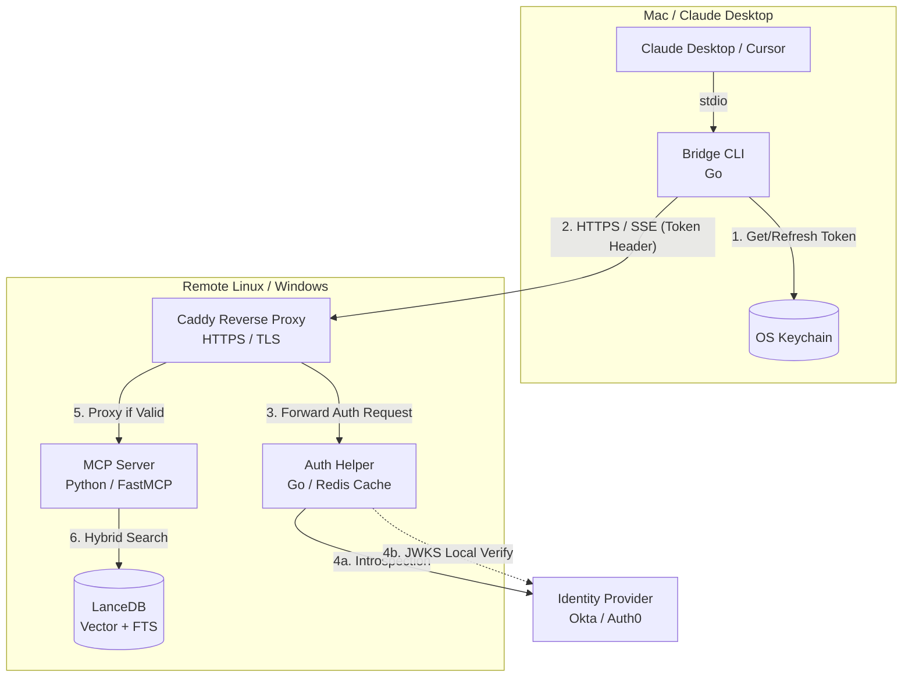
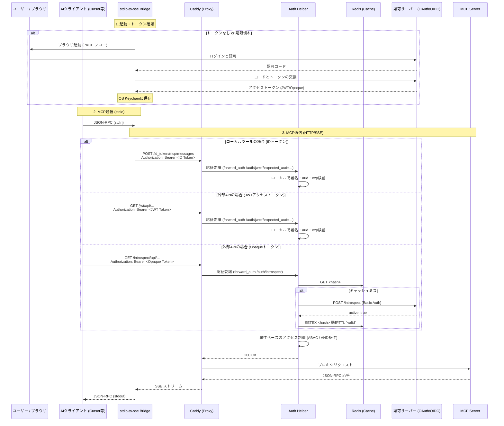
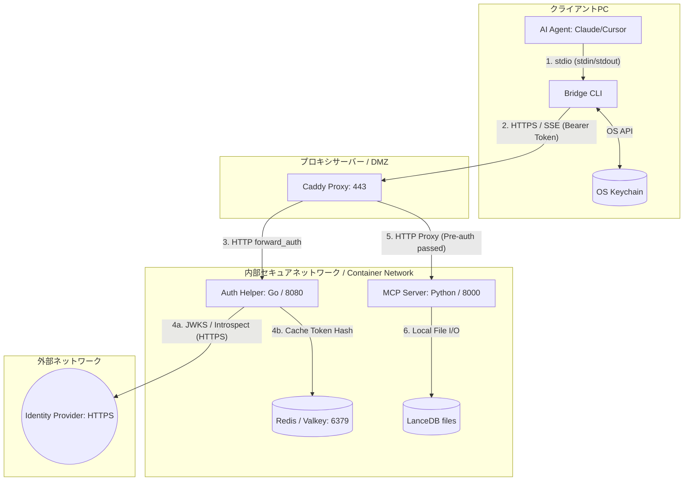
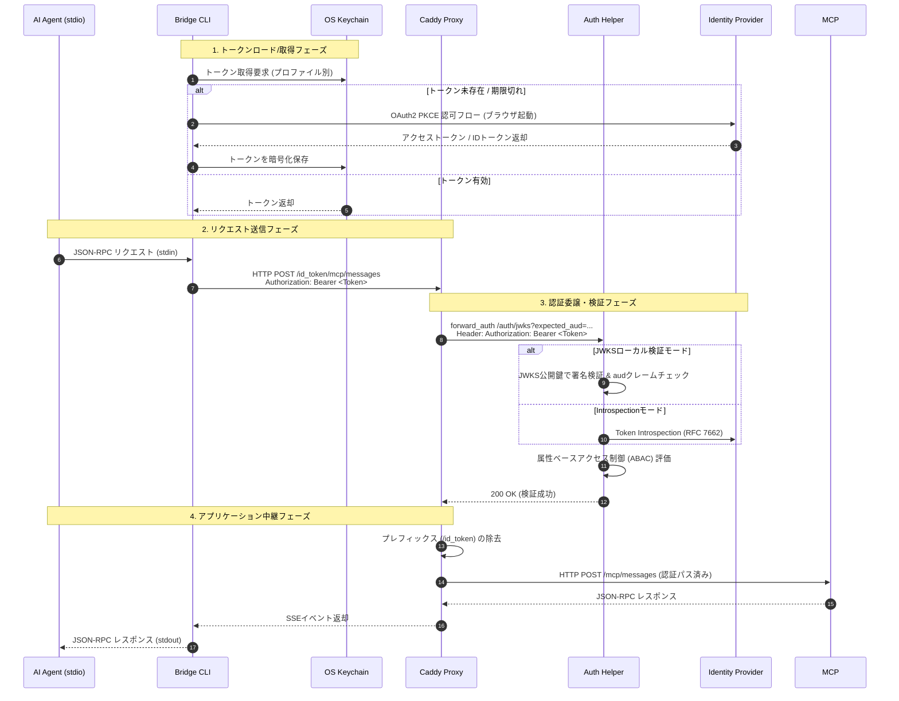

# アーキテクチャ設計書

本システムは、ローカル環境のAIエージェント（Claude Desktop, Cursorなど）から、セキュアな社内ネットワークやクラウド上のMCPサーバー（Model Context Protocol Server）へ接続するための認証・プロキシ基盤です。特定のベンダーに依存しない汎用的な **OAuth 2.0 / OIDC (RFC 7662: Token Introspection)** に準拠しています。

## 1. コンポーネント構成図

## 2. 認証シーケンス図

以下の構成により、アプリケーション（MCPサーバー）から認証の責務を完全に切り離した「多層防御アーキテクチャ」を実現しています。

## 3. コンポーネント詳細

### 3.1 stdio-to-sse Bridge (ローカルクライアント)
*   **役割**: 標準入出力（stdio）しかサポートしていないAIクライアントに対し、HTTP POSTおよびSSE（Server-Sent Events）プロトコルへの透過的な変換を提供します。
*   **認証UX**: 起動時に有効なトークンが無い場合、自動的にOSのブラウザを開いて認可サーバーへ誘導する PKCE (Proof Key for Code Exchange) フローを実行します。
*   **セキュリティ**: 取得したトークンは平文ファイルではなく、OSが提供するネイティブのシークレットマネージャ（macOS Keychain, Windows Credential Manager等）に暗号化して保存されます。

### 3.2 Caddy (フロントプロキシ)
*   **役割**: 外部からのトラフィックの入り口。HTTPS化（自動証明書）やリバースプロキシを担います。
*   **プレフィックス・ルーティング**: クライアントはアクセス先の先頭に `/id_token/`, `/jwt/`, または `/introspect/` を付与します。Caddyはこれを見て Auth Helper の対応する検証エンドポイントへ検証を依頼します。さらに、Caddyの環境変数展開機能を利用し、Go側に必要な情報をクエリパラメータとして動的に渡します。検証成功後にプレフィックスを削除してバックエンドへ転送します。これにより、すべてのバックエンドエンドポイントで各種認証方式を安全かつ明示的に利用できます。
*   **ストリーミング最適化**: MCPのSSE通信が途切れないよう、バッファリングを完全に無効化（`flush_interval -1`）しています。

### 3.3 Auth Helper (認証サイドカー)
*   **役割**: 渡された Bearer トークンが有効かどうかを検証し、細やかなアクセス制御を行います。同時に両方の検証エンドポイントを提供します。
*   **検証エンドポイント**:
    *   **`/auth/jwks`**: ローカル署名検証。URLクエリパラメータ `expected_aud` を必須として受け取り、トークンの `aud` クレームと完全に一致するかをチェックします。Caddy側がこのパラメータを制御することで、1つのハンドラーでIDトークンとJWTアクセストークンの両方を安全に検証します。
    *   **`/auth/introspect`**: Opaqueトークン等を用いた RFC 7662 問い合わせ検証。
*   **属性ベースのアクセス制御 (ABAC)**: トークンのペイロードに含まれるクレーム（`iss`, `aud`, `client_id`, `scope` など）を厳格に検証するフェーズ1と、ユーザー固有の属性（`email` や `groups`, `sub` など）に基づいてフィルタリングするフェーズ2を備えています。複数の条件を設定した場合、それらはすべて **AND条件** として評価され、条件を一つでも満たさないリクエストは拒否されます。

### 3.4 Redis / Valkey (キャッシュストア)
*   **役割**: Introspection モードを使用する際に、認可サーバーへの問い合わせによる API レートリミット枯渇や通信遅延を防ぐため、検証結果を一定時間保持します。
*   **セキュリティ**: トークンの **SHA-256ハッシュ値** をキーとして `"valid"` という状態のみを保存します。
*   **TTL**: キャッシュの有効期間は環境変数 `AUTH_INTROSPECT_CACHE_TTL_SECONDS` によって制御可能（デフォルト600秒=10分）です。JWKSモードではローカル検証が高速なため、キャッシュは使用されません。

### 3.5 MCP Server (アプリケーション)
*   **役割**: 実際のRAG検索やデータ処理を行うコアロジックです。
*   **責務の分離**: 認証に関するコードを一切持ちません。「Caddyを通過したリクエストはすべて安全である」という前提で動作します。

---

## 4. コンポーネント間接続・データフロー詳細

システム内の各コンポーネントがどのように通信し、データおよび認証トークンがどのように伝播するかを詳細に示します。

### 4.1 ネットワーク境界と接続プロトコル

| 接続元 | 接続先 | プロトコル | デフォルトポート | 用途・説明 |
| :--- | :--- | :--- | :--- | :--- |
| **AI Agent** | **Bridge CLI** | `stdio` | N/A (パイプ) | 標準入出力（stdin/stdout）を介したJSON-RPCによるMCP通信。 |
| **Bridge CLI** | **Caddy** | `HTTPS (TLS)` / `SSE` | `443` (テスト時 `80`/`8443`等) | 暗号化されたHTTP POST（メッセージ送信）およびServer-Sent Events（メッセージ受信）。 |
| **Caddy** | **Auth Helper** | `HTTP` | `8080` | `forward_auth`ディレクティブに基づく認証委譲リクエスト。 |
| **Auth Helper** | **Identity Provider** | `HTTPS` | `443` | JWKS鍵セット取得またはToken Introspectionエンドポイントへの検証要求。 |
| **Auth Helper** | **Redis / Valkey** | `Redis Protocol` | `6379` | Introspection結果のハッシュキャッシュストアへの接続。 |
| **Caddy** | **MCP Server** | `HTTP` | `8000` | 認証に成功したリクエストのルーティング転送（SSEストリーム）。 |
| **MCP Server** | **LanceDB** | `In-process (Arrow)` | N/A (ローカルI/O) | ベクトルデータベースファイル（`data/lancedb/`）への直接接続・クエリ。 |

### 4.2 認証シークレットのライフサイクルと伝播経路

認証トークン（JWTまたはOpaqueトークン）は、取得から検証、中継まで以下の経路をたどります。

### 4.3 テレメトリ（分散トレース）の伝播フロー

本システムは、コンポーネント境界を跨いでパフォーマンス分析およびデバッグを行えるよう、**OpenTelemetry (W3C Trace Context規格)** に準拠したトレースIDの伝播を行います。

1. **Bridge CLI**: API呼び出し開始時に新規 `trace_id` を発行、または親コンテキストを継承。HTTPリクエスト送信時にヘッダーへ注入：
   - `traceparent: 00-4bf92f3577b34da6a3ce929d0e0e4736-00f067aa0ba902b7-01`
2. **Caddy**: トラフィックをプロキシする際、ヘッダー内の `traceparent` を壊さず透過的に中継。
3. **Auth Helper**: 認証処理のスパンを作成し、Bridgeから引き継いだ `traceparent` を基に親スパンと紐付け。
4. **MCP Server**: PythonのFastAPIがリクエストを受信した際、`traceparent` を解析し、データベースクエリ（LanceDB）や再評価処理（Reranker）の実行スパンを紐付け。
5. **コレクターへの送信**: 各コンポーネントは `OTEL_EXPORTER_OTLP_ENDPOINT` で指定された共通のAPMコレクター（Jaeger, Grafana Tempo等）へ個別にスパンを送信し、単一の分散トレースとして可視化されます。

---

## 5. 機能提供・コンポーネントマッピング

システムが提供する個別の技術的機能が、どのコンポーネントのどのモジュールで実現されているかをマッピングします。

| 技術機能カテゴリ | 具体的な機能 | 実現コンポーネント | 該当ソースファイル・ディレクティブ | 制御環境変数 / 設定値 |
| :--- | :--- | :--- | :--- | :--- |
| **クライアント通信** | stdio-to-sseブリッジ変換 | `Bridge CLI` | [client/bridge/main.go](file:///c:/Users/ryotn/antigravity/remote-rag/client/bridge/main.go) [client/bridge/sse.go](file:///c:/Users/ryotn/antigravity/remote-rag/client/bridge/sse.go) [client/bridge/transmitter.go](file:///c:/Users/ryotn/antigravity/remote-rag/client/bridge/transmitter.go) | `MCP_REMOTE_URL` |
| **クライアント認証** | PKCE認可コードフロー | `Bridge CLI` | [client/bridge/auth.go](file:///c:/Users/ryotn/antigravity/remote-rag/client/bridge/auth.go) | `OAUTH_ISSUER_URL`, `OAUTH_CLIENT_ID` |
| **トークン保護** | OSネイティブ保護保存 | `Bridge CLI` | [client/bridge/auth.go](file:///c:/Users/ryotn/antigravity/remote-rag/client/bridge/auth.go) (go-keyring) | `RRAG_PROFILE` |
| **プロキシ制御** | プレフィックスルーティング | `Caddy` | [deploy/Caddyfile](file:///c:/Users/ryotn/antigravity/remote-rag/deploy/Caddyfile) | `Caddyfile`ルーティング規則 |
| **プロキシ制御** | ストリーム最適化フラッシュ | `Caddy` | [deploy/Caddyfile](file:///c:/Users/ryotn/antigravity/remote-rag/deploy/Caddyfile) | `flush_interval -1` |
| **トークン検証** | JWKSローカル署名検証 | `Auth Helper` | [server/auth-helper/main.go](file:///c:/Users/ryotn/antigravity/remote-rag/server/auth-helper/main.go) | `OAUTH_VALIDATION_MODE=jwks` `OAUTH_JWKS_URL` |
| **トークン検証** | Introspection問合せ | `Auth Helper` | [server/auth-helper/main.go](file:///c:/Users/ryotn/antigravity/remote-rag/server/auth-helper/main.go) | `OAUTH_VALIDATION_MODE=introspect` `OAUTH_INTROSPECT_URL` |
| **検証キャッシュ** | トークンSHA-256キャッシュ | `Redis / Valkey` `Auth Helper` | [server/auth-helper/cache.go](file:///c:/Users/ryotn/antigravity/remote-rag/server/auth-helper/cache.go) | `CACHE_TYPE=redis` `AUTH_INTROSPECT_CACHE_TTL_SECONDS` |
| **認可制御** | 属性ベースアクセス制御 (ABAC) | `Auth Helper` | [server/auth-helper/main.go](file:///c:/Users/ryotn/antigravity/remote-rag/server/auth-helper/main.go) (`validate*Constraints`) | `AUTH_FILTER_ISS` `AUTH_FILTER_AUD` `AUTH_FILTER_CLIENT_ID` `AUTH_FILTER_SCOPES` `AUTH_FILTER_EMAIL_DOMAINS` `AUTH_FILTER_EMAILS` `AUTH_FILTER_GROUPS` `AUTH_FILTER_SUBJECTS` |
| **MCPプロトコル** | FastMCPツール定義 | `MCP Server` | [server/core/src/mcp_server/server.py](file:///c:/Users/ryotn/antigravity/remote-rag/server/core/src/mcp_server/server.py) | Python実行構成 |
| **データベース** | ハイブリッドインデックス検索 | `MCP Server` `LanceDB` | [server/core/src/database/client.py](file:///c:/Users/ryotn/antigravity/remote-rag/server/core/src/database/client.py) | `LANCEDB_PATH` |
| **RAG/ベクトル** | 量子化モデル埋め込み | `MCP Server` | [server/core/src/database/schema.py](file:///c:/Users/ryotn/antigravity/remote-rag/server/core/src/database/schema.py) | `EMBEDDING_MODEL` `EMBEDDING_ONNX_FILE` `VECTOR_DIM` |
| **RAG/ベクトル** | CrossEncoder再評価 | `MCP Server` | [server/core/src/database/reranker.py](file:///c:/Users/ryotn/antigravity/remote-rag/server/core/src/database/reranker.py) | `RERANKER_MODEL` `RERANKER_ONNX_FILE` |
| **RAG検索調整** | 類似度スコア閾値制御 | `MCP Server` | [server/core/src/mcp_server/searcher.py](file:///c:/Users/ryotn/antigravity/remote-rag/server/core/src/mcp_server/searcher.py) | `DEFAULT_RELEVANCE_THRESHOLD` `EXACT_MATCH_RELEVANCE_THRESHOLD` |
| **可観測性** | Prometheus & OTel メトリクス | `Auth Helper` `MCP Server` | [server/auth-helper/main.go](file:///c:/Users/ryotn/antigravity/remote-rag/server/auth-helper/main.go) (initTelemetry) | `OTEL_EXPORTER_OTLP_ENDPOINT` `OTEL_EXPORTER_OTLP_METRICS_ENABLED` |

