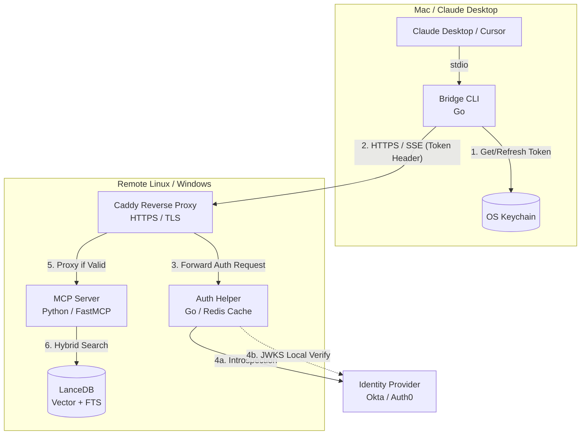
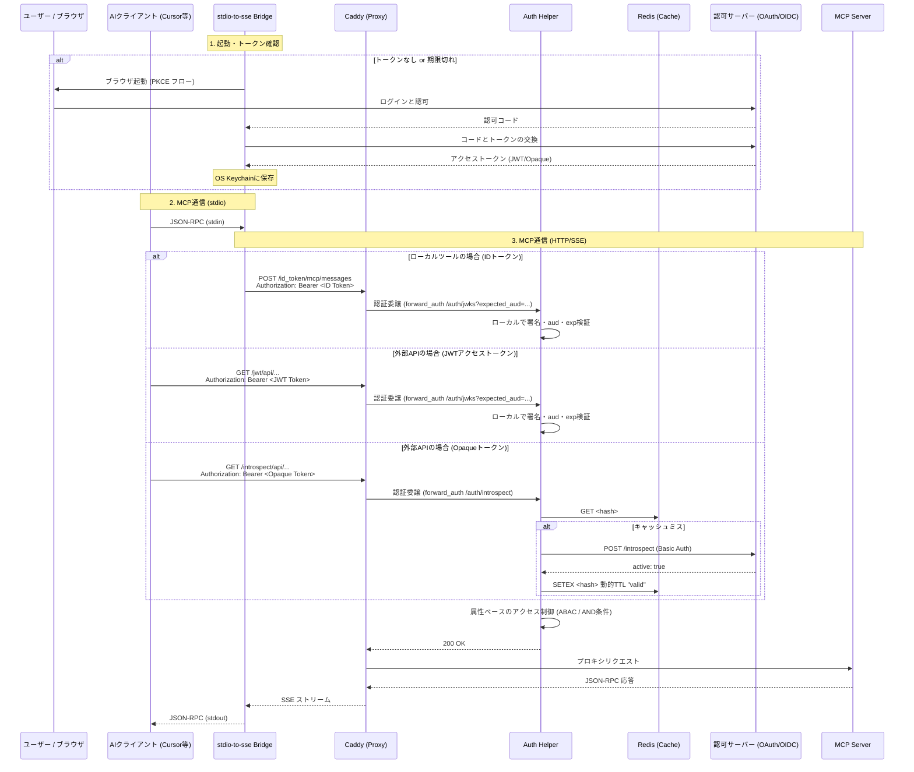

# アーキテクチャ設計書

本システムは、ローカル環境のAIエージェント（Claude Desktop, Cursorなど）から、セキュアな社内ネットワークやクラウド上のMCPサーバー（Model Context Protocol Server）へ接続するための認証・プロキシ基盤です。特定のベンダーに依存しない汎用的な **OAuth 2.0 / OIDC (RFC 7662: Token Introspection)** に準拠しています。

## 1. コンポーネント構成図

## 2. 認証シーケンス図

以下の構成により、アプリケーション（MCPサーバー）から認証の責務を完全に切り離した「多層防御アーキテクチャ」を実現しています。

## 3. コンポーネント詳細

### 3.1 stdio-to-sse Bridge (ローカルクライアント)
*   **役割**: 標準入出力（stdio）しかサポートしていないAIクライアントに対し、HTTP POSTおよびSSE（Server-Sent Events）プロトコルへの透過的な変換を提供します。
*   **認証UX**: 起動時に有効なトークンが無い場合、自動的にOSのブラウザを開いて認可サーバーへ誘導する PKCE (Proof Key for Code Exchange) フローを実行します。
*   **セキュリティ**: 取得したトークンは平文ファイルではなく、OSが提供するネイティブのシークレットマネージャ（macOS Keychain, Windows Credential Manager等）に暗号化して保存されます。

### 3.2 Caddy (フロントプロキシ)
*   **役割**: 外部からのトラフィックの入り口。HTTPS化（自動証明書）やリバースプロキシを担います。
*   **プレフィックス・ルーティング**: クライアントはアクセス先の先頭に `/id_token/`, `/jwt/`, または `/introspect/` を付与します。Caddyはこれを見て Auth Helper の対応する検証エンドポイントへ検証を依頼します。さらに、Caddyの環境変数展開機能を利用し、Go側に必要な情報をクエリパラメータとして動的に渡します。検証成功後にプレフィックスを削除してバックエンドへ転送します。これにより、すべてのバックエンドエンドポイントで各種認証方式を安全かつ明示的に利用できます。
*   **ストリーミング最適化**: MCPのSSE通信が途切れないよう、バッファリングを完全に無効化（`flush_interval -1`）しています。

### 3.3 Auth Helper (認証サイドカー)
*   **役割**: 渡された Bearer トークンが有効かどうかを検証し、細やかなアクセス制御を行います。同時に両方の検証エンドポイントを提供します。
*   **検証エンドポイント**:
    *   **`/auth/jwks`**: ローカル署名検証。URLクエリパラメータ `expected_aud` を必須として受け取り、トークンの `aud` クレームと完全に一致するかをチェックします。Caddy側がこのパラメータを制御することで、1つのハンドラーでIDトークンとJWTアクセストークンの両方を安全に検証します。
    *   **`/auth/introspect`**: Opaqueトークン等を用いた RFC 7662 問い合わせ検証。
*   **属性ベースのアクセス制御 (ABAC)**: トークンのペイロードに含まれるクレーム（`iss`, `aud`, `client_id`, `scope` など）を厳格に検証するフェーズ1と、ユーザー固有の属性（`email` や `groups`, `sub` など）に基づいてフィルタリングするフェーズ2を備えています。複数の条件を設定した場合、それらはすべて **AND条件** として評価され、条件を一つでも満たさないリクエストは拒否されます。

### 3.4 Redis / Valkey (キャッシュストア)
*   **役割**: Introspection モードを使用する際に、認可サーバーへの問い合わせによる API レートリミット枯渇や通信遅延を防ぐため、検証結果を一定時間保持します。
*   **セキュリティ**: トークンの **SHA-256ハッシュ値** をキーとして `"valid"` という状態のみを保存します。
*   **TTL**: キャッシュの有効期間は環境変数 `AUTH_INTROSPECT_CACHE_TTL_SECONDS` によって制御可能（デフォルト600秒=10分）です。JWKSモードではローカル検証が高速なため、キャッシュは使用されません。

### 3.5 MCP Server (アプリケーション)
*   **役割**: 実際のRAG検索やデータ処理を行うコアロジックです。
*   **責務の分離**: 認証に関するコードを一切持ちません。「Caddyを通過したリクエストはすべて安全である」という前提で動作します。
