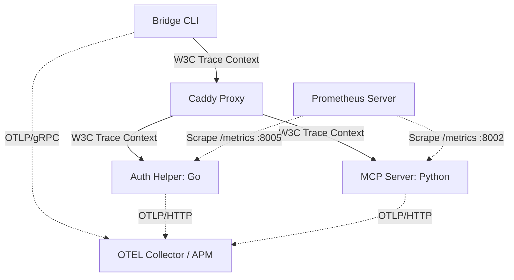

# 可観測性ガイド (Observability Guide)

本プロジェクト（RRAG）は、エンタープライズでの運用やトラブルシューティングを容易にするため、業界標準である **Prometheus（メトリクス）** および **OpenTelemetry（分散トレーシング）** に対応した可観測性（Observability）の仕組みを統合しています。

---

## 1. システム全体構成



---

## 2. 分散トレーシング (OpenTelemetry Tracing)

各コンポーネントはリクエストに共通の「トレースID」を乗せて通信し、ネットワークやシステム境界を越えた呼び出し経路（スパン）を追跡します。

### 2.1 環境変数の設定

コンテナを起動する前に、環境変数 `OTEL_EXPORTER_OTLP_ENDPOINT` を設定することでトレーシングが有効化されます。

- **`OTEL_EXPORTER_OTLP_ENDPOINT`**: OTel コレクター（Jaeger, Grafana Tempo 等）のエンドポイントベースURLを指定します。
  - 例: `http://localhost:4318` (HTTP/Protobufレシーバーの場合)
  - ※ 設定されていない場合、トレーシング処理は自動的にスキップされ、オーバーヘッドは発生しません。

### 2.2 トレースコンテキストの伝播 (Trace Context Propagation)

クライアント（Bridge CLI）から受信した HTTP ヘッダー内の `traceparent` (W3C Trace Context 形式) を基に、以降のプロキシ、認証ヘルパー、MCP サーバーのトレースが1つの木構造に紐付けられます。

#### ヘッダーの例：
```http
traceparent: 00-4bf92f3577b34da6a3ce929d0e0e4736-00f067aa0ba902b7-01
```
- `4bf92f3577b34da6a3ce929d0e0e4736`: トレースID (システム内で一貫)
- `00f067aa0ba902b7`: 親スパンID

### 2.3 トレーススパンの一覧

APM画面で検索・分析可能な主要スパン名と属性値は以下の通りです。

| スパン名 | 発生元コンポーネント | 主な属性値 (Attributes) | 説明 |
| :--- | :--- | :--- | :--- |
| `auth-helper` | Auth Helper (Go) | `http.method`, `http.status_code` | 認証リクエスト全体の処理。 |
| `introspectToken` | Auth Helper (Go) | `introspection.active` (bool) | RFC 7662 に基づく外部IdPへの問合せまたはキャッシュ確認処理。 |
| `verifyJWT` | Auth Helper (Go) | `error.reason` (検証エラー時) | JWKSによるローカル署名検証処理。 |
| `rrag-server-main` | MCP Server (FastAPI) | `http.route`, `http.status_code` | REST API / Ingest / SSE リクエストハンドラー。 |
| `search_wiki` | MCP Server (Python) | `search.query` (クエリ文字列)<br/>`search.limit` (件数上限) | Wikipedia チャンクに対するハイブリッド検索・Rerankの処理スパン。 |

---

## 3. メトリクス収集 (Prometheus Metrics)

各コンポーネントは Prometheus が収集可能な `/metrics` エンドポイントを公開しています。これにより、Grafana 等を用いて CPU 負荷、メモリ使用量、認証成功率、RAG検索レイテンシなどの監視パネルを構築できます。

### 3.1 エンドポイント一覧と公開ポート

Docker Compose で起動した際、以下のポートでメトリクススクレイプ用の HTTP サーバーが起動します。

| 対象コンポーネント | ポート (コンテナ外 / ホスト側) | エンドポイントパス | 説明 |
| :--- | :--- | :--- | :--- |
| **Auth Helper** (Go) | `8005` (コンテナ内 `8000`) | `http://localhost:8005/metrics` | 標準の Go ランタイム情報およびカスタム認証メトリクスをエクスポート。 |
| **MCP Server** (Python) | `8002` | `http://localhost:8002/` | Python ランタイム情報およびカスタムRAG検索カウントなどをエクスポート。 |
| **Caddy** | `2019` | `http://localhost:2019/metrics` | Caddy プロキシ内の HTTP トラフィックメトリクスをエクスポート。 |

### 3.2 カスタムメトリクス一覧

システム独自で収集している重要な Prometheus メトリクスです。

| メトリクス名 | タイプ | 収集元 | 説明 |
| :--- | :--- | :--- | :--- |
| `auth_requests_total` | カウンター | Auth Helper | 認証プロキシが処理したリクエストの総数。ラベルで検証エンドポイント（`/auth/jwks` 等）や結果ごとの統計を分析可能。 |
| `rrag_search_count_total` | カウンター | MCP Server | 実行されたナレッジ検索の総リクエスト数。 |

---

## 4. OTLP Metrics プッシュ機能 (オプション)

プル型の Prometheus スクレイプに加え、プッシュ型で OTel コレクターに直接メトリクスを送信することも可能です。

### 設定方法
各コンテナの環境変数に以下を設定します。
```dotenv
OTEL_EXPORTER_OTLP_ENDPOINT=http://otel-collector:4318
OTEL_EXPORTER_OTLP_METRICS_ENABLED=true
```
有効化すると、`auth.requests` や `rrag.search.count` といったシステムメトリクスが定期的に OTLP を介して APM バックエンドへ自動送信されます。
